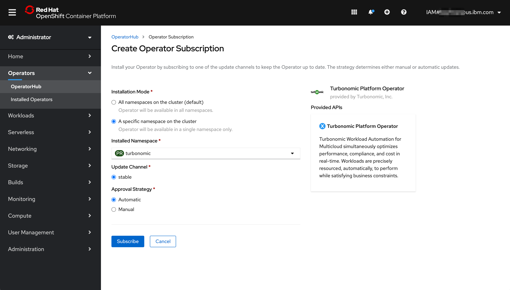
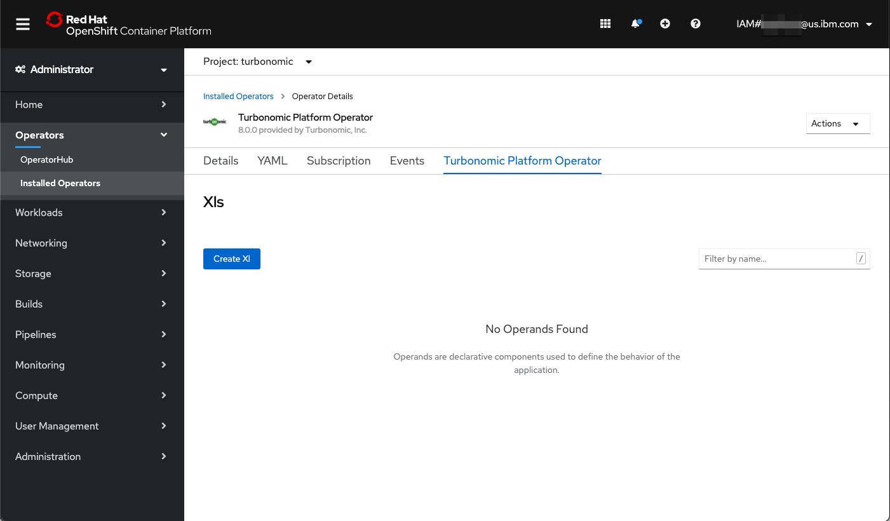
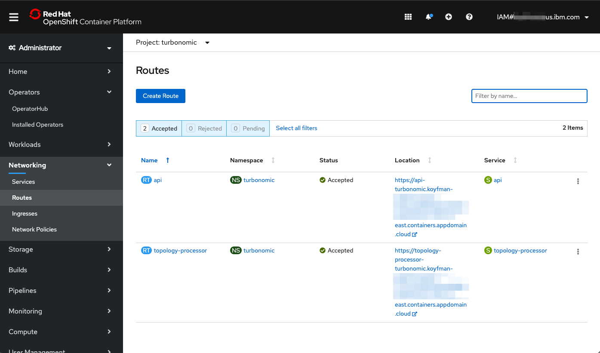
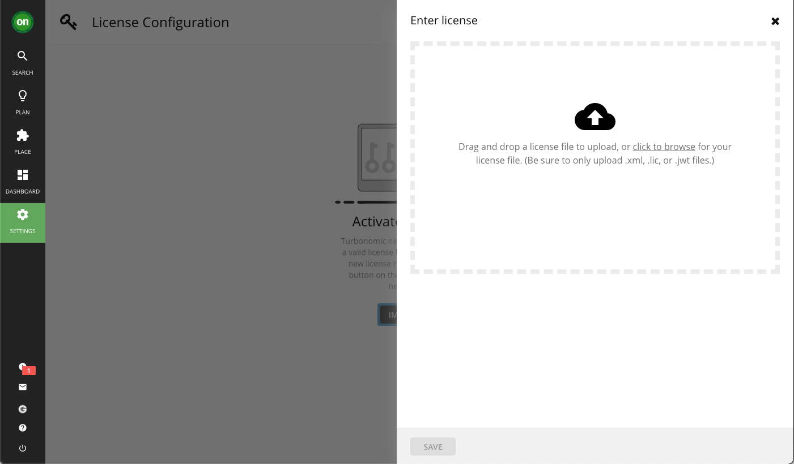
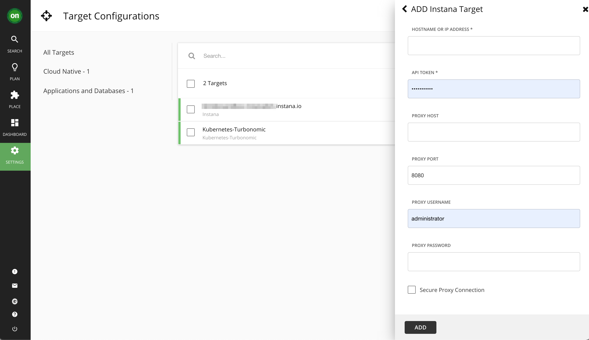
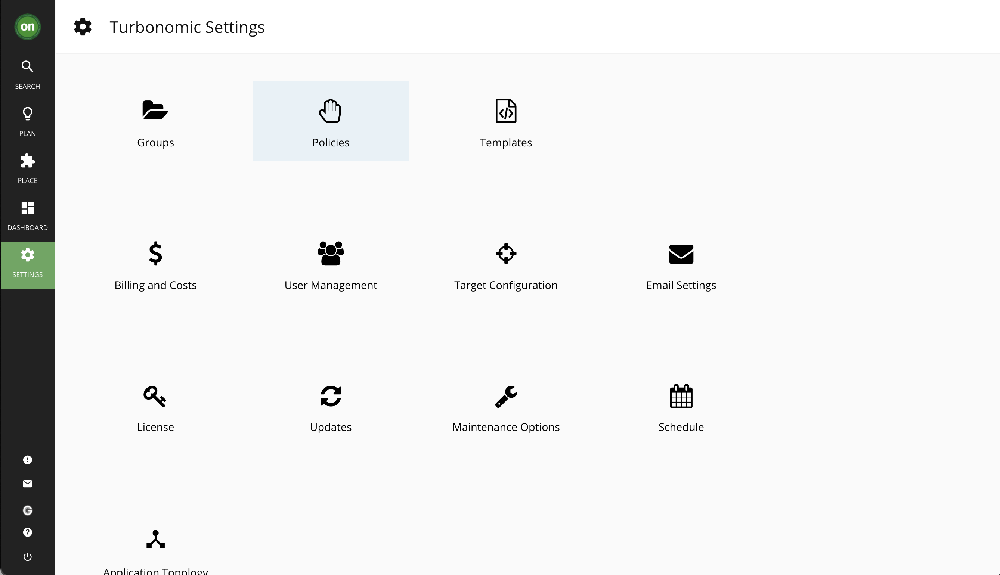
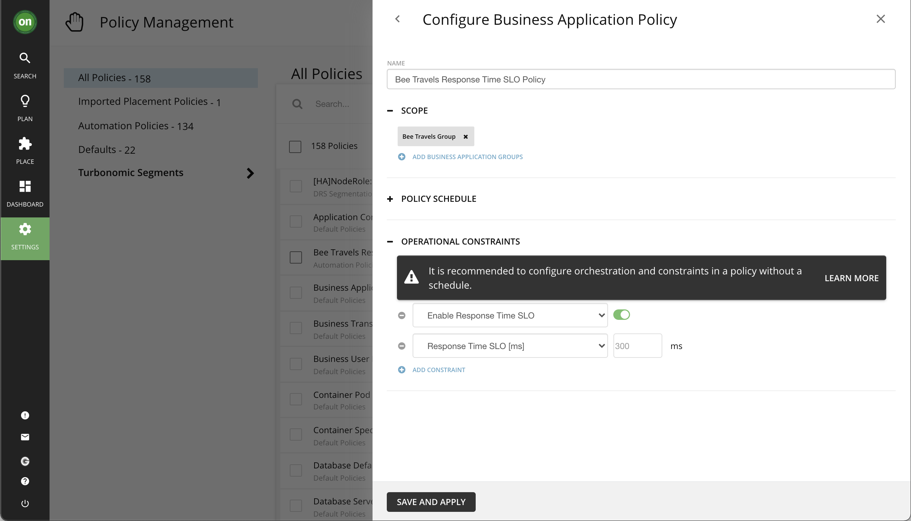
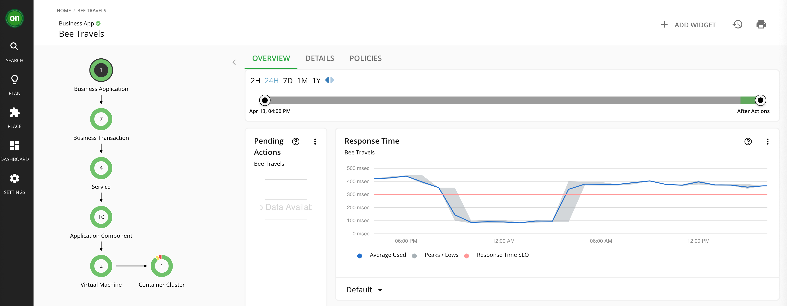
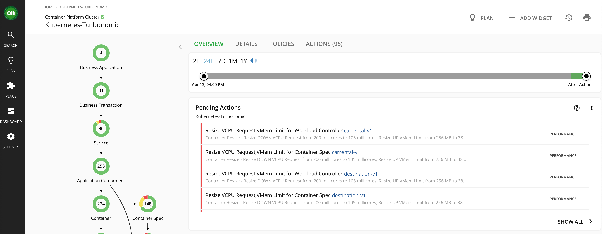

# Mejore-el-rendimiento-y-la-eficiencia-en-sus-implementaciones-de-Red-Hat-OpenShift

# Introducción
A medida que las implementaciones en la nube se vuelven más complejas, las herramientas para administrar el rendimiento de las aplicaciones y el monitoreo de los recursos de la infraestructura se vuelven más críticas. Si bien las herramientas de monitoreo del rendimiento de las aplicaciones (APM) como IBM Observability with Instana (Instana) son una categoría bien conocida que observa y resuelve problemas en las implementaciones de microservicios, la plataforma de contenedores y otras implementaciones en la nube han creado la necesidad de herramientas más sofisticadas para administrar la infraestructura. Turbonomic creó su herramienta de administración de recursos de aplicaciones (ARM) que ayuda a los operadores a comprender y administrar la infraestructura de la nube utilizando políticas centradas en SLO para reducir los gastos operativos y mejorar el rendimiento de la nube.

En este tutorial, mostramos cómo implementar Turbonomic Platform Operator en OpenShift, conectarlo a su implementación de Instana y demostrar cómo los dos servicios funcionan en conjunto para ayudar a administrar sus implementaciones de OpenShift.

## Requisitos previos
Para completar este tutorial, debe completar este patrón de código. El patrón de código lo guía a través de los siguientes pasos:

Integrar Instana
Implementar en OpenShift
Genere tráfico y analice con Instana
Nota: Turbonomic requiere un historial del tráfico de aplicaciones para tomar decisiones de rendimiento o eficiencia. Antes de iniciar la configuración de la plataforma Turbonomic, inicie el generador de carga Puppeteer como se describe en el patrón de código de Instana .

También necesitarás:

Cuenta de IBM Cloud .
Red Hat OpenShift en el clúster de IBM Cloud .
Licencia para Plataforma Turbonómica. Puede aprovechar Turbonomic a través de Red Hat Marketplace .
Hora prevista
Completar este tutorial debería tomar alrededor de 1 hora.

# Pasos a seguir
Configure Turbonomic en su clúster de OpenShift
Gestione el rendimiento con Turbonomic

# Configure Turbonomic en su clúster de OpenShift
Comenzaremos con la instalación del operador de la plataforma Turbonomic en su clúster OpenShift. Después de instalar el operador, necesitará una clave de licencia para activar la instancia y comenzar a usarla.

1. Crea un turbonomicproyecto (espacio de nombres).

2. Ejecute los siguientes comandos para este proyecto para crear los roles y permisos necesarios para el operador de la plataforma.

```
 $ oc project turbonomic
 $ oc create -f https://raw.githubusercontent.com/turbonomic/t8c-install/master/operator/deploy/cluster_role.yaml
 clusterrole.rbac.authorization.k8s.io/t8c-operator created
 $ oc create -f https://raw.githubusercontent.com/turbonomic/t8c-install/master/operator/deploy/cluster_role_binding.yaml
 clusterrolebinding.rbac.authorization.k8s.io/t8c-operator created
 $ oc adm policy add-scc-to-group anyuid system:serviceaccounts:turbonomic
 securitycontextconstraints.security.openshift.io/anyuid added to groups: ["system:serviceaccounts:turbonomic"]

```

3. En Red Hat OpenShift Container Platform Operator Hub, instale un operador Turbonomic.

Busque e instale el operador Turbonomic Platform. Cambie el espacio de nombres instalado a "Turbonomic" y haga clic en Suscribirse .

captura de pantalla de la instalación del operador de Red Hat OpenShift Operator Hub


El operador de Plataforma Turbonómica se muestra en Operadores instalados.

4. Seleccione el Operador de plataforma turbonómica para abrirlo y haga clic en **Crear Xl** para crear una instancia de un recurso "XL".

captura de pantalla de Red Hat OpenShift crear un recurso XL


5. Haga clic en el enlace **Editar formulario**. Luego, habilite estas opciones:

- Kubeturbo (para la gestión de clústeres locales)
- Instana, para habilitar Instana como fuente de datos.
- Ingress para crear una ruta a través de la cual pueda acceder al panel de Turbonomic.

Desplácese hasta el final de la lista de opciones y haga clic en el botón **Crear**.

6. Conéctese a la consola Turbonomic. En Red Hat OpenShift Container Platform, en la sección **Redes> Rutas**, haga clic en el enlace que comienza con "api-turbonomic" para abrir el panel.

captura de pantalla para el enlace de la consola Turbonomic


Configure su nombre de usuario y contraseña de administrador, y luego cargue su licencia Turbonomic.

captura de pantalla de la carga de la clave de licencia para Turbonomic Platform


7. Conecte Turbonomic a Instana, para que pueda permitir que Turbonomic recopile métricas de Instana.

   1. En la consola de Instana, en la página Configuración del equipo, haga clic en **Crear token de API** para crear una clave de API desde Instana.

   1. Conéctese a la consola de Instana haciendo clic en **Configuración> Configuraciones de destino> Nuevo destino> Aplicaciones y bases de datos> Instana**, y luego agregue el nombre de host de Instana y la clave API (que acaba de crear).

captura de pantalla de la conexión a la consola Instana


## Administre el rendimiento de sus implementaciones de OpenShift con Turbonomic
Primero, configuremos una política:

1. Vaya al mosaico Políticas en Configuración:

captura de pantalla de la política en plataforma turbonómica


2. Cree una nueva Política de aplicaciones comerciales para Bee Travels con la configuración que se muestra en esta captura de pantalla:

captura de pantalla de la política en plataforma turbonómica

Con la política configurada, Turbonomic analizará los datos de rendimiento a lo largo del tiempo para proporcionar recomendaciones de ubicación y tamaño de recursos. Utilice la herramienta Titiritero descrita en el patrón de código de Instana para generar tráfico a la aplicación. Turbonomic puede necesitar de 10 a 15 minutos de datos y análisis para crear una lista de acciones recomendadas.

captura de pantalla de la política en plataforma turbonómica


Ahora, veamos cómo se está desempeñando la aplicación.

1. Abra su panel de Instana. Vaya a **Kubernetes > Su clúster > espacio de nombres bee-travels** . Seleccione **Pods** y elija la vista **Mapa**. Analice los límites de la CPU, las solicitudes de CPU, los límites de memoria y las solicitudes de memoria. Por ejemplo, así es como se ven los límites de la CPU antes de cualquier mejora:

captura de pantalla de instana dashboard showig cpu limits


2. Ahora que se ha analizado suficiente tráfico, podemos ir al panel de Turbonomic y navegar hasta la aplicación Bee Travels. Observará las secciones rojas, amarillas y verdes de los círculos en la sección Container Cluster del Business Application Tree en el lado izquierdo de la pantalla. Haga clic en ese círculo y lo llevará a la siguiente pantalla:

captura de pantalla de las acciones pendientes del panel Turbonomic

3. Notará que hay acciones pendientes que Turbonomic sugiere que mejorarán el rendimiento y la eficiencia de la aplicación. Haga clic en el elemento Workload Controller, luego seleccione **Show All** y seleccione todas las acciones pendientes que son para los servicios de Bee Travels. Una vez seleccionados, seleccione el botón **Aplicar seleccionados** para aplicar las acciones.

4. En este punto, los pods cambiarán de tamaño y se reiniciarán, por lo que habrá unos segundos de tiempo de inactividad de la aplicación. Puede ver el progreso en su consola OpenShift.

5. Después de unos minutos más o menos para permitir que los nuevos pods cambien de tamaño y se reinicien con las mejoras de rendimiento y el tráfico a la aplicación para comenzar de nuevo, regrese al panel de Instana para ver las mejoras en los límites de CPU, solicitudes de CPU, límites de memoria, y solicitudes de memoria. Por ejemplo, así es como se ven los límites de la CPU después de mis mejoras:

captura de pantalla del panel de instana que muestra los límites de la CPU después de las mejoras


Debería ver que a pesar de los cambios en la utilización de recursos por parte de los servicios de Bee Travels, el tiempo de respuesta mejorará o seguirá siendo el mismo.
