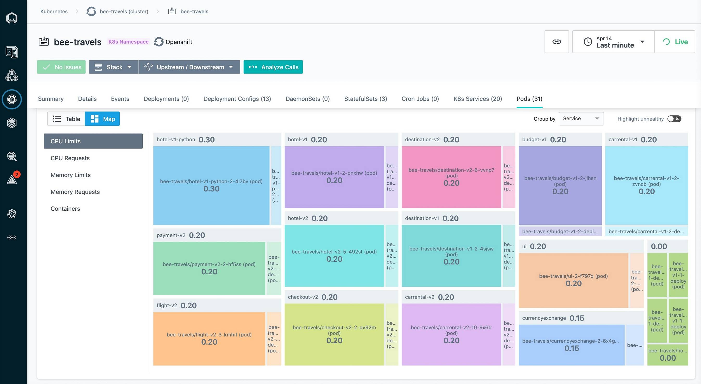

# Mejore el rendimiento y la eficiencia en sus implementaciones de Red Hat OpenShift

# Introducción
A medida que las implementaciones en la nube se vuelven más complejas, las herramientas para administrar el rendimiento de las aplicaciones y el monitoreo de los recursos de la infraestructura se vuelven más críticas. Si bien las herramientas de monitoreo del rendimiento de las aplicaciones (APM) como [IBM Observability with Instana](https://www.ibm.com/cloud/instana) (Instana) son una categoría bien conocida que observa y resuelve problemas en las implementaciones de microservicios, la plataforma de contenedores y otras implementaciones en la nube han creado la necesidad de herramientas más sofisticadas para administrar la infraestructura. Turbonomic creó su herramienta de administración de recursos de aplicaciones (ARM) que ayuda a los operadores a comprender y administrar la infraestructura de la nube utilizando políticas centradas en SLO para reducir los gastos operativos y mejorar el rendimiento de la nube.

En este tutorial, mostramos cómo desplegar Turbonomic Platform Operator en OpenShift, como conectarlo a su implementación de Instana y demostrar cómo los dos servicios funcionan en conjunto para ayudar a administrar sus implementaciones de OpenShift.

## Requisitos previos
Para completar este tutorial, deben completar [este](https://github.com/BryanJCCF/Integre-Instana-con-una-aplicacion-de-microservicio-en-OpenShift-) Code Pattern. El Code Pattern lo guía a través de los siguientes pasos:

Integrar Instana
Desplegar en OpenShift
Generen tráfico y analicen con Instana

>Nota: Turbonomic requiere un historial del tráfico de aplicaciones para tomar decisiones de rendimiento o eficiencia. Antes de iniciar la configuración de la plataforma Turbonomic, inicien el generador de carga Puppeteer como se describe en el [Code Pattern de Instana.](https://github.com/BryanJCCF/Integre-Instana-con-una-aplicacion-de-microservicio-en-OpenShift-)

También necesitarán:

- [Cuenta de IBM Cloud.](https://cloud.ibm.com/registration?cm_sp=ibmdev-_-developer-tutorials-_-cloudreg)
- [Red Hat OpenShift en el clúster de IBM Cloud.](https://cloud.ibm.com/kubernetes/catalog/create?platformType=openshift?cm_sp=ibmdev-_-developer-tutorials-_-cloudreg)
- Licencia para Plataforma Turbonómica. Puede aprovechar [Turbonomic a través de Red Hat Marketplace.](https://marketplace.redhat.com/en-us/products/turbonomic-platform?_ga=2.4379379.1735084987.1635194387-319746362.1617664077)

# Hora prevista
Completar este tutorial debería tomar alrededor de 1 hora.

# Secuencia
1. [Requisitos previos](#requisitos-previos)
2. [Configure Turbonomic en su clúster de OpenShift](#configure-turbonomic-en-su-clúster-de-openshift)
3. [Administre el rendimiento de sus implementaciones de OpenShift con Turbonomic](#administre-el-rendimiento-de-sus-implementaciones-de-openshift-con-turbonomic)

# Pasos a seguir

## Configuren Turbonomic en su clúster de OpenShift
Comenzaremos con la instalación del operador de la plataforma Turbonomic en su clúster OpenShift. Después de instalar el operador, necesitarán una clave de licencia para activar la instancia y comenzar a usarla.

1. Creen un turbonomicproyecto (espacio de nombres).

2. Ejecuten los siguientes comandos para este proyecto para crear los roles y permisos necesarios para el operador de la plataforma.

```
 $ oc project turbonomic
 $ oc create -f https://raw.githubusercontent.com/turbonomic/t8c-install/master/operator/deploy/cluster_role.yaml
 clusterrole.rbac.authorization.k8s.io/t8c-operator created
 $ oc create -f https://raw.githubusercontent.com/turbonomic/t8c-install/master/operator/deploy/cluster_role_binding.yaml
 clusterrolebinding.rbac.authorization.k8s.io/t8c-operator created
 $ oc adm policy add-scc-to-group anyuid system:serviceaccounts:turbonomic
 securitycontextconstraints.security.openshift.io/anyuid added to groups: ["system:serviceaccounts:turbonomic"]

```

3. En Red Hat OpenShift Container Platform Operator Hub, instalen un operador Turbonomic.

Busquen e instalen el operador Turbonomic Platform. Cambien el espacio de nombres instalado a "Turbonomic" y hagan clic en Suscribirse .


El operador de Plataforma Turbonómica se muestra en Operadores instalados.

4. Seleccionen el Operador de plataforma turbonómica para abrirlo y hagan clic en **Crear Xl** para crear una instancia de un recurso "XL".


5. Hagan clic en el enlace **Editar formulario**. Luego, habiliten estas opciones:

- Kubeturbo (para la gestión de clústeres locales)
- Instana, para habilitar Instana como fuente de datos.
- Ingress para crear una ruta a través de la cual pueda acceder al panel de Turbonomic.

Desplácense hasta el final de la lista de opciones y hagan clic en el botón **Crear**.

6. Conéctense a la consola Turbonomic. En Red Hat OpenShift Container Platform, en la sección **Redes> Rutas**, hagan clic en el enlace que comienza con "api-turbonomic" para abrir el panel.


Configuren su nombre de usuario y contraseña de administrador, y luego carguen su licencia Turbonomic.


7. Conecten Turbonomic a Instana, para que pueda permitir que Turbonomic recopile métricas de Instana.

   1. En la consola de Instana, en la página Configuración del equipo, hagan clic en **Crear token de API** para crear una clave de API desde Instana.

   1. Conéctense a la consola de Instana haciendo clic en **Configuración> Configuraciones de destino> Nuevo destino> Aplicaciones y bases de datos> Instana**, y luego agreguen el nombre de host de Instana y la clave API (que acaba de crear).


## Administre el rendimiento de sus implementaciones de OpenShift con Turbonomic
Primero, configuremos una política:

1. Vayan al mosaico Políticas en Configuración:


2. Creen una nueva Política de aplicaciones comerciales para Bee Travels con la configuración que se muestra en esta captura de pantalla:


Con la política configurada, Turbonomic analizará los datos de rendimiento a lo largo del tiempo para proporcionar recomendaciones de ubicación y tamaño de recursos. Utilicen la herramienta Titiritero descrita en el [Code Pattern de Instana](https://github.com/BryanJCCF/Integre-Instana-con-una-aplicacion-de-microservicio-en-OpenShift-) para generar tráfico a la aplicación. Turbonomic puede necesitar de 10 a 15 minutos de datos y análisis para crear una lista de acciones recomendadas.


Ahora, veamos cómo se está desempeñando la aplicación.

1. Abran su panel de Instana. Vayan a **Kubernetes > Su clúster > espacio de nombres bee-travels** . Seleccionen **Pods** y elijan la vista **Mapa**. Analicen los límites de la CPU, las solicitudes de CPU, los límites de memoria y las solicitudes de memoria. Por ejemplo, así es como se ven los límites de la CPU antes de cualquier mejora:


2. Ahora que se ha analizado suficiente tráfico, podemos ir al panel de Turbonomic y navegar hasta la aplicación Bee Travels. Observarán las secciones rojas, amarillas y verdes de los círculos en la sección Container Cluster del Business Application Tree en el lado izquierdo de la pantalla. Hagan clic en ese círculo y los llevará a la siguiente pantalla:


3. Notarán que hay acciones pendientes que Turbonomic sugiere que mejorarán el rendimiento y la eficiencia de la aplicación. Hagan clic en el elemento Workload Controller, luego seleccione **Show All** y seleccione todas las acciones pendientes que son para los servicios de Bee Travels. Una vez seleccionados, seleccionen el botón **Aplicar seleccionados** para aplicar las acciones.

4. En este punto, los pods cambiarán de tamaño y se reiniciarán, por lo que habrá unos segundos de tiempo de inactividad de la aplicación. Pueden ver el progreso en su consola OpenShift.

5. Después de unos minutos más o menos para permitir que los nuevos pods cambien de tamaño y se reinicien con las mejoras de rendimiento y el tráfico a la aplicación para comenzar de nuevo, regresen al panel de Instana para ver las mejoras en los límites de CPU, solicitudes de CPU, límites de memoria, y solicitudes de memoria. Por ejemplo, así es como se ven los límites de la CPU después de mis mejoras:



Deberían ver que a pesar de los cambios en la utilización de recursos por parte de los servicios de Bee Travels, el tiempo de respuesta mejorará o seguirá siendo el mismo.

# Resumen y próximos pasos

En este tutorial, mostramos cómo configurar una plataforma Turbonomic en su instancia de OpenShift, conectarse a Instana para monitorear una aplicación en ejecución y configurar una política para permitir que Turbonomic evalúe la asignación de recursos y la ubicación de los pods en un clúster. Consulte la [documentación de Turbonomic](http://docs.turbonomic.com/pdfdocs/Turbonomic_User_Guide_8.0.0.pdf) para obtener más información sobre la configuración y el uso.

Para obtener más detalles sobre cómo usar Instana y Turbonomic juntos, revise esta [Descripción general de la solución Instana + Turbonomic.](https://www.turbonomic.com/resources/data-sheets/instana-turbonomic-overview/)
